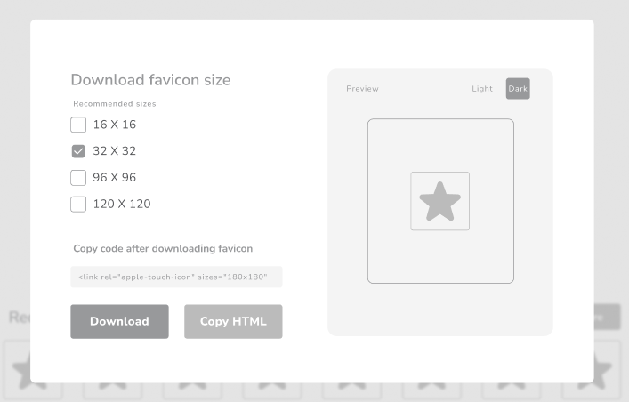

# 🧲[](https://hamzamohdzubair.github.io/redant/)
A Favicon generator app, converts image design(.PNG, .JPEG) to smaller [favicon](https://en.wikipedia.org/wiki/Favicon) sizes which are available for download and available to use in the HTML code

# Projects Description
The application allows users to upload images and they convert the images into the different sizes of favicon. Users can choose the sizes they want and then download.
The HTML [embed](https://en.wikipedia.org/wiki/Embedded) code is also available to use during coding process.





# Website Preview Image


## Technologies Used to Achieve this project 🛠️

This project was created with 
<div style="background-color: rgb(50, 50, 50);">

 
and the following technologies were used: <br/>

* ♎ __Design__<br/>
        

* ⚛️ __Frontend__<br/>
      
      
      

* ⚙️ __Backend__<br/>
        
        


* 🛢️ __Database__<br/>
        


* 🎡 __Project Management and Version Control__<br/>
        
</div>
Python, Django Framework, HTML, CSS Javascript and MySQL are used to build the project. The design structure of the project is a [Monolithic](https://en.wikipedia.org/wiki/Monolithic_application) application. HTML, CSS and Javascript are use in the frontend, Python Django framework is used for the backend and MySQL as the database

# How to Install and Run the Project
-  run git clone https://github.com/zuri-training/Favicon_gen-Team-68.git 
- create a virtual environment
- run <div style="background-color: rgb(50, 50, 50);">```pip install -r requirements.txt``` </div>
  - # Database
    - To use the default sqlite database
      - run ```python manage.py makemigrations```
      - run ```python manage.py migrate```
      - run ```python manage.py runserver localhost:8000```
    - To use postgreSQL as default database
      - Install [postgreSQL](https://www.postgresql.org/download/)
      - create a ```.env``` file in your project root directory
      - In the ```.env``` define variable name ```USE_PROD=1``` and ```DB_PWD=<your database password>```
      - run ```python manage.py makemigrations```
      - run ```python manage.py migrate```
      - run ```python manage.py runserver localhost:8000```


- [Figma WorkSpace](https://www.figma.com/file/Om0i0dm6XOQN27utcHw5QD/Favicon-general?node-id=0%3A1)

## License
[Apache](https://www.apache.org/licenses/) Licensed

## Contributors
All thanks goes to these wonderful teamates for making sure this project came to being👏
<!--Please use the format below to add your own details. 3 persons in each row -->
<table>
  <tr>
    <td align="center" style="backgroundColor:blueviolet";>
    <br />
    <a href="https://tony-smile.github.io/mock-poetfolio/#"><b>Profile</b></a><br>
    </td>
  </tr>
  <tr>
    
 
  </tr>
</table>
